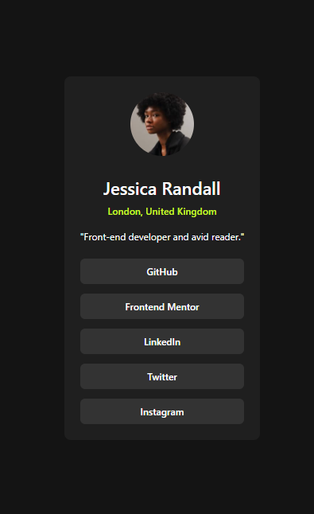
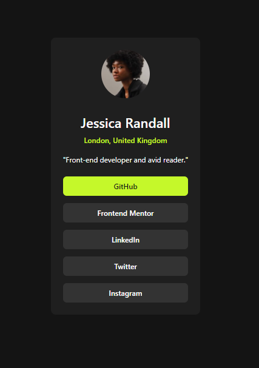

# Frontend Mentor - Social links profile solution

This is a solution to the [Social links profile challenge on Frontend Mentor](https://www.frontendmentor.io/challenges/social-links-profile-UG32l9m6dQ). Frontend Mentor challenges help you improve your coding skills by building realistic projects. 

## Table of contents

- [Overview](#overview)
  - [The challenge](#the-challenge)
  - [Screenshot](#screenshot)
  - [Links](#links)
- [My process](#my-process)
  - [Built with](#built-with)
  - [What I learned](#what-i-learned)
  - [Continued development](#continued-development)
  - [Useful resources](#useful-resources)
- [Author](#author)
- [Acknowledgments](#acknowledgments)

## Overview

### The challenge

Users should be able to:

- See hover and focus states for all interactive elements on the page

### Screenshot

### Links

- Solution URL: [solution URL](https://www.frontendmentor.io/solutions/mobile-first-solution-using-tailwind-bIfkxgBiPJ)
- Live Site URL: live site URL](https://janak1998.github.io/social-links-profile-main/)

## My process

### Built with

- Semantic HTML5 markup
- CSS3 
- Flexbox
- Mobile-first workflow
- [Taiwind](https://tailwindcss.com/) - CSS framework

### What I learned

During this CSS challenge, I used Tailwind CSS for the first time, and I found it easier than installing the full package via npm. I also learned that even an empty Tailwind configuration file is necessary for the Tailwind classes to function correctly.
-[Tailwind CDN setup](https://tailwindcss.com/docs/installation/play-cdn)

### Useful resources

- [Tailwind Official Docs](https://tailwindcss.com/) - This helped me for tailwind classes. 

## Author

- Website - [Janak Bohra](https://luxury-pavlova-7b3197.netlify.app/)
- Frontend Mentor - [@yourusername](https://www.frontendmentor.io/profile/yourusername)
- Twitter - [@yourusername](https://x.com/BohraJanak)

